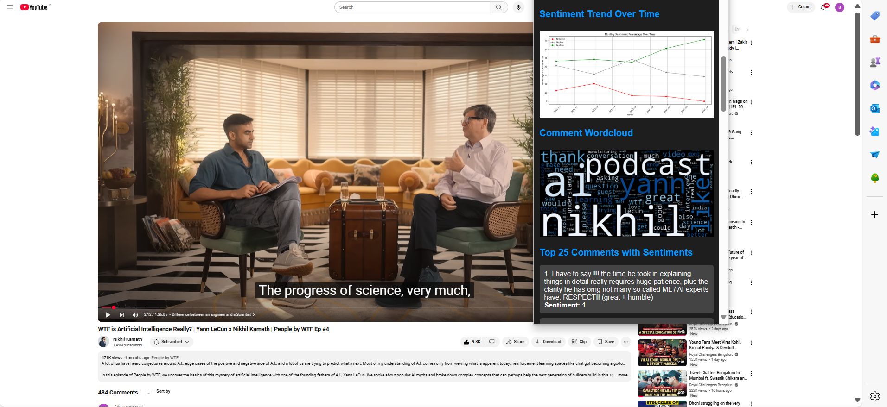

<h1 align="center">🔮 Real-Time YouTube Sentiment Analyzer</h1>

  <b>AI meets YouTube — where every comment speaks, and we listen.</b> 
  <i>An intelligent Chrome extension that reads the crowd before you even scroll.</i>

---

## 🚀 Project Vision

Every video sparks a sea of emotions.  
But manually filtering through thousands of comments? Not scalable. Not smart.

🎯 **Mission**: Deliver real-time sentiment insights — directly into YouTube’s UI.  
⚡ **Result**: Instant emotion tagging as you browse. Think: ✨ NLP x UX ✨

---

## 🧠 The Intelligence Layer

> “Don’t just read comments — *understand* them.”

Powered by a **fine-tuned LightGBM model**, this extension classifies each comment as:

- ✅ **Positive**
- ⚪ **Neutral**
- ❌ **Negative**

All in real time. Zero clicks. Pure signal.

---

## 🌐 Who's This For?

| 👥 **Role**           | 💡 **How It Helps**                                                       |
|----------------------|---------------------------------------------------------------------------|
| 🎥 **YouTubers**      | Gauge real-time audience feedback and spot early criticism                |
| 📈 **Digital Marketers** | Analyze brand sentiment across campaigns & creators                     |
| 🧪 **Data Researchers** | Study public reactions across niches without scraping tools              |

---

## 🎥 Watch It in Action

▶️ 

 
Live walkthrough showing how the plugin plugs into YouTube’s UI like magic ✨

---

## 🧰 Behind the Scenes – The Tech That Powers It

| 🧩 **Layer**         | ⚙️ **Tools & Frameworks**                                                                 |
|----------------------|---------------------------------------------------------------------------------------------|
| **ML & NLP Engine**   | `LightGBM`, `TfidfVectorizer`, `Optuna` (for hyperparameter tuning)                        |
| **MLOps Backbone**    | `DVC` for data/pipeline versioning, `MLflow` for model tracking, `Docker`, `AWS Stack`     |
| **Frontend (Plugin)** | `HTML`, `CSS`, `JavaScript`, `Manifest v3`                                                 |
| **Backend API**       | `Flask` app serving model via Docker, deployed on `AWS EC2` + `ECR`, CI/CD via `CodeDeploy`|

---

## ✨ Core Highlights

💬 **Real-Time UX Integration**  
→ Comments are tagged as you scroll — directly on YouTube.

🔬 **NLP-Driven Classifier**  
→ Custom-trained LightGBM model optimized with Optuna.

🌩️ **Cloud-Deployed at Scale**  
→ Full deployment on AWS (EC2, ECR, CodeDeploy, S3) with scalable, versioned pipelines.

🧪 **Experimentation-Ready**  
→ DVC + MLflow make it easy to iterate and reproduce model experiments.

---

## 🧾 Repositories You Need

| 📁 **Component**        | 🔗 **GitHub Repo**                                                                 |
|-------------------------|------------------------------------------------------------------------------------|
| 🧠 Model + Backend API   | [YouTube-Comment-Sentiment-Analysis](https://github.com/akashagalave/YouTube-Comment-Sentiment-Analysis) |
| 🌐 Chrome Extension UI   | [YT-CHROME-PLUGIN](https://github.com/akashagalave/YT-CHROME-PLUGIN)               |

---

## 🧪 Try It Yourself – Run Locally

### 🔧 Step 1: Start the Flask Backend

git clone https://github.com/akashagalave/YouTube-Comment-Sentiment-Analysis.git
cd YouTube-Comment-Sentiment-Analysis
pip install -r requirements.txt
python app.py

The Flask server will start and serve the ML model at http://127.0.0.1:5000.

### 🧩 Step 2: Load the Chrome Extension
git clone https://github.com/akashagalave/YT-CHROME-PLUGIN.git

Then follow these steps in your browser:

1.  Open chrome://extensions
2.  Enable Developer Mode (toggle at the top-right)
3.  Click Load Unpacked
4.  Select the YT-CHROME-PLUGIN directory

Done ✅ Your browser is now AI-enhanced
---

Built with grit, grind, and ❤️ by [Akash Agalave](https://github.com/akashagalave)

 

